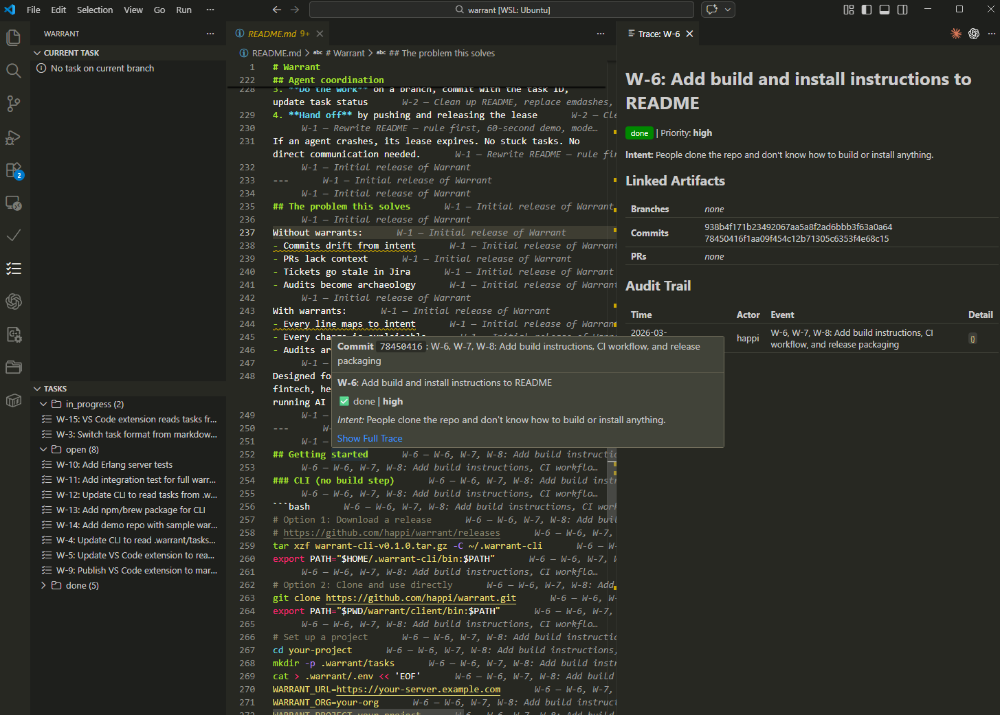

# Warrant

**Every change needs a warrant.**

If you cannot answer *why* a line of code exists, the system has lost memory.
Warrant restores that link.

---

## Try it (60 seconds)

```bash
# 1. Initialize warrant in your repo
warrant init AUR
# > Creates .warrant/ directory, sets task prefix to AUR

# 2. Create a task
warrant task create "Fix token refresh" \
  --intent "Users get 401 errors after sessions longer than 1 hour" \
  --priority high \
  --labels "bug,auth"
# > Created .warrant/tasks/AUR-1.md

# 3. Start working (creates branch automatically)
warrant task start AUR-1
# > Created branch: task/AUR-1-fix-token-refresh
# ... fix the bug ...
git commit -m "AUR-1: fix token refresh logic"

# 4. Trace
warrant trace AUR-1
```

Output:

```
AUR-1: Fix token refresh
  Status:   in_progress
  Intent:   Users get 401 errors after sessions longer than 1 hour

  Commits:
    abc1234 AUR-1: fix token refresh logic

  Branches:
    * task/AUR-1-fix-token-refresh

  Audit (task file history):
    2026-03-18 10:05  erik  AUR-1: fix token refresh logic
```

Or ask *why* a commit exists:

```bash
warrant why abc1234
```

```
abc1234a AUR-1: fix token refresh logic
  Author: erik
  Date:   2026-03-18
  Task:   AUR-1

  AUR-1: Fix token refresh

  Intent:
    Users get 401 errors after sessions longer than 1 hour
```

Every commit traces to a task. Every task declares intent. Every change is explainable.

---

## The Rule

**Every change must have a warrant.**

A warrant is:
- A **task ID**, unique and traceable
- An **intent**, why this change exists
- A **trace** to code changes: branches, commits, PRs

Code without a warrant is a guess that happened to compile.

---

## What is Warrant?

Warrant is a **model**:

1. Link code to intent
2. Store intent in the repo
3. Make the trace reconstructable

### This repository

This repo contains:
- A **CLI** for creating tasks, tracing changes, generating release notes, and coordinating agents
- A **VS Code extension** for sidebar task views and inline blame annotations
- **Conventions** for branches, commits, and task files
- An **optional server** for coordination, web UI, and notarization

You don't need all of it. The model works with just task files and commit conventions.

---

## Task files live in your repo

```
.warrant/
  tasks/
    AUR-42.md          # Every task: frontmatter + intent + decision
    AUR-43.md
  decisions/           # Architecture decisions (optional)
  policies/            # Team policies (optional)
```

A real task file:

```markdown
---
id: AUR-42
title: Fix token refresh
status: done
priority: high
labels: [bug, auth]
created_by: erik
created_at: 2026-03-18T10:00:00Z
---

## Intent

Users get 401 errors after sessions longer than 1 hour.

## Decision

Retry with exponential backoff. Simpler than token refresh,
covers more failure modes.

## Notes

Considered refresh-before-expiry but that requires tracking token
lifetime per provider. Backoff is stateless and handles network
failures too.
```

Git history on this file *is* the audit trail. No external database needed.

---

## Three layers of why

| Layer | Question | Where it lives |
|-------|----------|---------------|
| **Intent** | Why does this task exist? | Task file |
| **Decision** | Why this approach, not another? | Task file |
| **Audit** | Who did what, when? | Git history |

---

## The server is optional

It does not store project data.

It can:
- **Allocate IDs** so they are monotonic with no collisions across agents
- **Guard status transitions** with compare-and-swap to prevent race conditions
- **Coordinate agents** with leases and TTL so crashed agents do not block work
- **Notarize commits** in an append-only hash chain for compliance verification

The repository remains the source of truth. Always.

---

## Example: fixing a production bug

**1. Create the warrant**

```markdown
# .warrant/tasks/AUR-42.md
---
id: AUR-42
title: Fix token refresh
status: open
priority: high
---

## Intent

Users get 401 errors after sessions longer than 1 hour.

## Decision

Retry with exponential backoff. Simpler than refresh, covers more failure modes.
```

**2. Start working**

```bash
warrant task start AUR-42
# > Created branch: task/AUR-42-fix-token-refresh
# ... fix the bug ...
git commit -m "AUR-42: add retry with exponential backoff"
git commit -m "AUR-42: add backoff tests"
```

**3. Open PR**

```
AUR-42: Fix token refresh

Intent: Users get 401 errors after sessions longer than 1 hour
Decision: Retry with backoff instead of token refresh. Simpler, covers more failure modes.
```

**4. Six months later, someone reads the code**

```bash
git blame src/auth.erl
# > commit abc1234, message "AUR-42: add retry with exponential backoff"

warrant trace AUR-42
# > intent, decision, all commits, PR, full history
```

The system remembers why.

---

## Agent coordination

Multiple agents (AI coding agents, CI bots, humans) coordinate through warrants:

1. **Find work** by reading open tasks from the repo
2. **Claim it** by acquiring a lease (atomic, TTL-based, 409 on conflict)
3. **Do the work** on a branch, commit with the task ID, update task status
4. **Hand off** by pushing and releasing the lease

If an agent crashes, its lease expires. No stuck tasks. No direct communication needed.

---

## The problem this solves

Without warrants:
- Commits drift from intent
- PRs lack context
- Tickets go stale in Jira
- Audits become archaeology

With warrants:
- Every line maps to intent
- Every change is explainable
- Audits are queries, not investigations

Designed for systems where you must explain every change: fintech, healthcare, regulated environments, and teams running AI coding agents.

---

## Getting started

### CLI (no build step)

```bash
# Option 1: Download a release
# https://github.com/happi/warrant/releases
tar xzf warrant-cli-v0.2.0.tar.gz -C ~/.warrant-cli
export PATH="$HOME/.warrant-cli/bin:$PATH"

# Option 2: Clone and use directly
git clone https://github.com/happi/warrant.git
export PATH="$PWD/warrant/client/bin:$PATH"

# Set up a project
cd your-project
warrant init PRJ

# Install git hooks (enforces task IDs in commit messages)
install-hooks
```

### VS Code extension



Tasks in the sidebar, blame annotations inline, trace view with full audit trail.

```bash
# Option 1: Install from .vsix release
# Download from https://github.com/happi/warrant/releases
code --install-extension warrant-vscode-v0.2.0.vsix

# Option 2: Build from source
cd warrant/vscode
npm ci
npm run compile
# Then: Ctrl+Shift+P > "Developer: Install Extension from Location" > select warrant/vscode
```

The extension activates when it finds `.warrant/config.yaml`, `.warrant/tasks/`, or `.warrant/.env` in the open folder.

### Server (optional, Erlang/OTP)

Only needed for ID allocation, status CAS, leases, or the compliance hash chain.

```bash
cd warrant/server
rebar3 compile
rebar3 shell    # starts on port 8090

# Or build a Docker image
docker build -t warrant-server .
docker run -p 8090:8090 -v /data:/data warrant-server
```

## Project structure

```
warrant/
├── client/          CLI tools, git hooks, CI integration
│   ├── bin/         warrant, warrant-setup, install-hooks
│   ├── hooks/       commit-msg, pre-push, post-push
│   └── ci/          GitHub Actions workflow template
├── server/          Erlang/OTP (optional: ID, CAS, leases, hash chain)
│   ├── src/         Erlang source
│   ├── docs/        Architecture, API reference, data model
│   └── Dockerfile
├── vscode/          VS Code extension
│   ├── src/         TypeScript source
│   └── package.json
└── .warrant/        Warrant's own task tracking (dogfooding)
    └── tasks/       W-1.md, W-2.md, ...
```

See [server/docs/](server/docs/) for architecture, API reference, and data model.

## CI

The repo includes GitHub Actions workflows:

- **CI** (on push/PR): compiles server, compiles extension, shellchecks CLI, verifies task IDs in commit messages
- **Release** (on tag `v*`): packages CLI tarball and VS Code .vsix, generates warrant-based release notes, creates GitHub Release

## License

MIT
